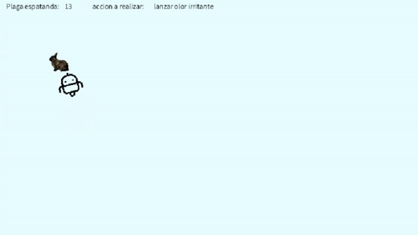
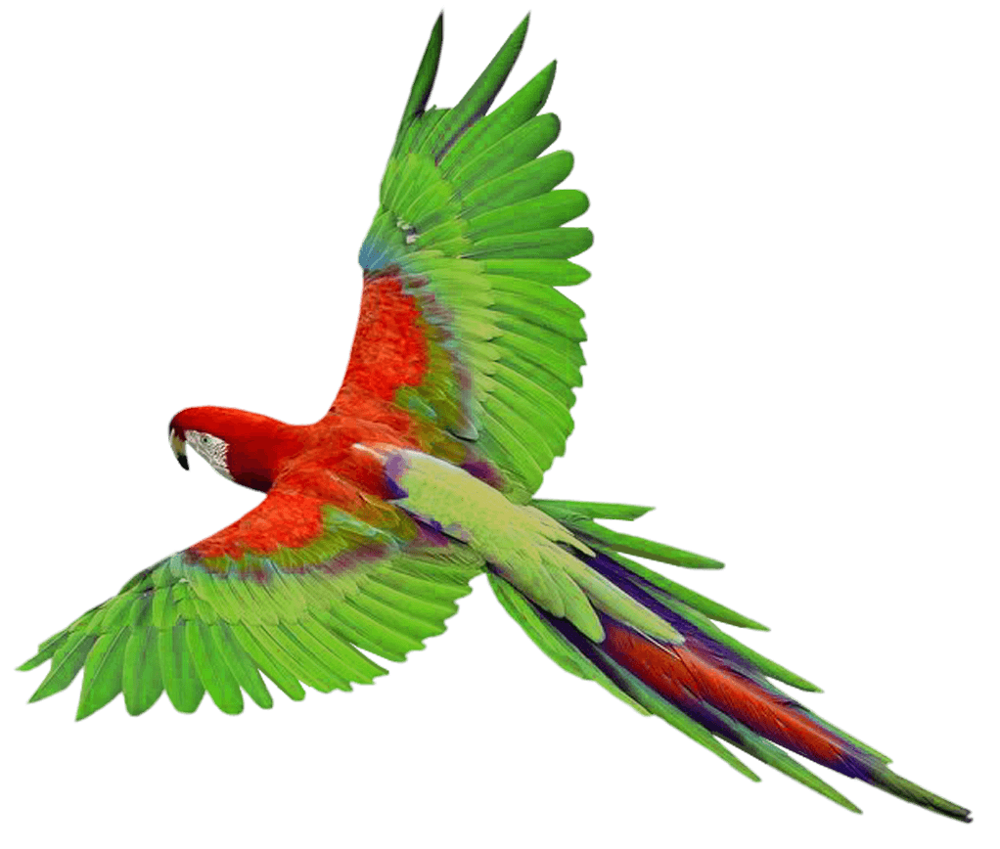

# Desarrollo de entornos y agentes
<p style="text-align:  center;">

</p>


## Trabajo a realizar
> IMPORTANTE: La mayoría del código fue extraido de  [este artículo](https://github.com/MEBM1/mebm-AgenteAutonomo-SI).

Crear un software que simule un agente considerando, los diferentes tipos de escenarios y agentes que se revisaron en clases, el agente debe corresponder con un robot que espanta aves, insectos u otro tipo de plagas en un sembradio, debe recorrer el sembradio por cuadrantes y aplicar un tipo de accion para eliminar la amenaza de los cultivos, el agente deberá funciona indeterminadamente.


En esta tarea realiza las siguiente acciones:
- Aparece una plaga en la pantalla en una posición aleatoria.
- El agente percibe la plaga en el ambiente y se mueve hacia la plaga para espantarla.
- Cuando ocurre la colisión entre el agente y la plaga, la plaga desaparece del ambiente y se cuenta. (La plaga se espanto).
- Vuelve al paso 1 (aparece otra plaga en el ambiente).
## Diferentes plagas que aparecen en el ambiente:


<p style="text-align:  center; background-color: white;">



</p>

## Clase Plaga

```python
class Plaga():
    def __init__(self, x, y, vel,pos):
        self.acceleration = PVector(0, 0)
        self.velocity = vel
        self.position = PVector(x, y)
        self.r = 6
        self.maxspeed = 1.0
        self.maxforce = 0.01
        self.contador = 0
        self.i=pos

    def update(self):
        self.velocity.add(self.acceleration)
        self.velocity.limit(self.maxspeed)
        self.position.add(self.velocity)
        self.acceleration.mult(0)

    def applyForce(self, force):
        self.acceleration.add(force)

    def display(self):
        theta = self.velocity.heading()
        fill(0)
        noStroke()
        with pushMatrix():
            translate(self.position.x, self.position.y)
            rotate(theta)
            img = loadImage("imagenes/img{}.png".format(self.i))
            image(img,0,0,28,28)

            
    def getPosition(self):
        return self.position
    
    def collision(self):
        self.contador = self.contador + 1
        self.position = PVector(random.randint(0,620), random.randint(0,340))
        self.i=random.randint(1,5)
    
    def getContador(self):
        return self.contador
```
## robot:
<p style="text-align:  center; background-color: white; color:white">

</p>

## Clase Vehicle
```python
class Vehicle():
    def __init__(self, x, y, vel):
        self.acceleration = PVector(0, 0)
        self.velocity = vel
        self.position = PVector(x, y)
        self.r = 6
        self.maxspeed = 5
        self.maxforce = 0.2

    # Método para actualizar la ubicación
    def update(self):
        self.velocity.add(self.acceleration)
        self.velocity.limit(self.maxspeed)
        self.position.add(self.velocity)
        self.acceleration.mult(0)

    def applyForce(self, force):
        self.acceleration.add(force)

    # Un método que calcula una fuerza de dirección hacia un objetivo
    def arrive(self, target):
        # Un vector que apunta desde la ubicación hasta el objetivo.
        desired = target - self.position
        d = desired.mag()
        if (d < 100):
            m = map(d, 0, 100, 0, self.maxspeed)
            desired.setMag(m)
        else:
            desired.setMag(self.maxspeed)
        steer = desired - self.velocity
        steer.limit(self.maxforce) 
        self.applyForce(steer)


    def boundaries(self, d):
        desired = None
        if self.position.x < d:
            desired = PVector(self.maxspeed, self.velocity.y)
        elif self.position.x > width - d:
            desired = PVector(-self.maxspeed, self.velocity.y)
        if self.position.y < d:
            desired = PVector(self.velocity.x, self.maxspeed)
        elif self.position.y > height - d:
            desired = PVector(self.velocity.x, -self.maxspeed)

        if desired:
            desired.normalize()
            desired.mult(self.maxspeed)
            steer = desired - self.velocity
            steer.limit(self.maxforce)
            self.applyForce(steer)
            
    def display(self):
        theta = self.velocity.heading() + PI / 2
        fill(0,0,0)
        noStroke()
        strokeWeight(1)
        with pushMatrix():
            translate(self.position.x, self.position.y)
            rotate(theta)
            img2 = loadImage("imagenes/robot6.png")
            image(img2,0,0,40,40)
            
    def getPosition(self):
        return self.position
```
    
## main
se importan las clases y algunas librerias
```python
from Vehicle import Vehicle
from Plaga import Plaga
import random
import math
```
La función __setup__ se ejecuta una vez, cuando se inicia el programa.
Se declaran las variables  y se instancia la clase __Plaga__ y la clase __Vehicle__
```python
def setup():
    global vehicle
    size(680, 390)
    velocity = PVector(1, 0)
    vehicle = Vehicle(width / 2, height / 2, velocity)
    global plaga 
    vel = PVector(0,0)
    plaga = Plaga(random.randint(0,640), random.randint(0,360), vel,2) 
```

La funcion __draw__ ejecuta continuamente las líneas de código contenidas dentro de su bloque
```python
def draw():
    background(231,253,255)
    mouse = PVector(mouseX, mouseY)
    vehicle.update()
    vehicle.display()
    plaga.update()
    plaga.display()
    target = plaga.getPosition()
    vehicle.arrive(target)
    count = plaga.contador
    texto = "Plaga espatanda:"
    text (texto, 10,15)
    text(count, 105,15)
    if (plaga.getPosition().dist(vehicle.getPosition()) <= 4):
        plaga.collision()

```
