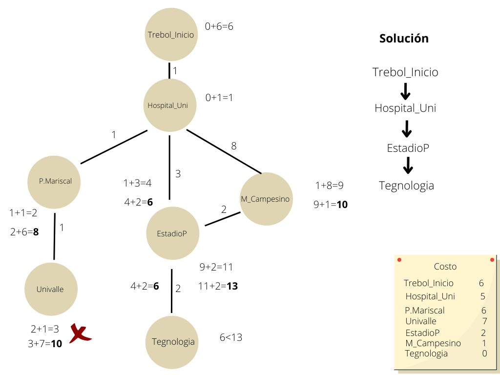
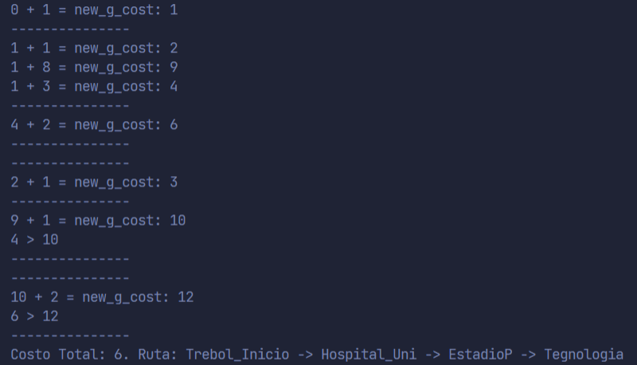

# Busqueda A*
__Estudiante:__ Achu Gabriel Ariel

A* o "A estrella" es la combinación de Uniform-cost y Greedy. Órdenes de costo uniforme por costo de ruta o costo hacia atrás - g(n). Órdenes codiciosas por proximidad a la meta o costo adelantado - h(n). A* Órdenes de búsqueda por la suma: f(n) = g(n) + h(n)

## Trabajo a realizar
> IMPORTANTE: Gran parte del código fue extraido de  [este artículo](https://github.com/marcoscastro/a_star_search_algorithm).

Implementar un programa en python que utilize la busqueda informada A*, no debe repetir el problema de aplicación con sus compañeros, para ello debe registrar su objeto de aplicación de la búsqueda en el foro habilitado para este proposito, el primero que registre sera quien oficialmente asuma ese ambito de aplicacion, quedando los restantes sin posibilidad de ser evaluados. Ademas de entregar el codigo fuente y la direccion del repositorio de github, se debe realizar una explicacion detallar del trabajo desarrollado, a parte de que el codigo debe estar suficientemente comentado. 

## Ejemplos a realizar (Encontrar el camino mas corto entre dos puntos)
#### Ejemplo 1 
Desde __"trebol_Inicio"__ llegar a la __"Terminal"__ por el camino mas corto.

Se tiene el siguiente escenario:

#### Solución Ejemplo 1 
Como se escogio el mejor camino a la terminal:

#### ¿Cómo se llego a esa solución?

#### Ejemplo 2 
Desde __"trebol_Inicio"__ llegar a  __"Tecnologia"__ por el camino mas corto.

Se tiene el siguiente escenario:

#### Solución Ejemplo 1 
Como se escogio el mejor camino a la terminal:

