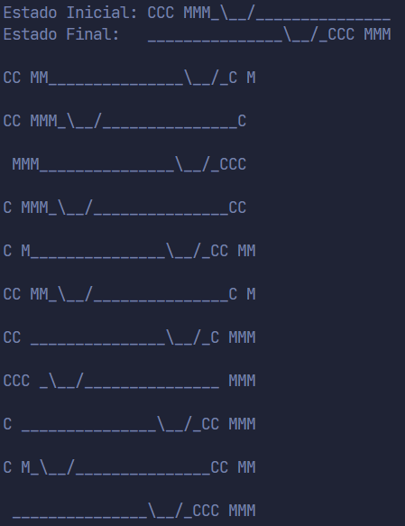

# Canibales y Misioneros

<p>

</p>

## Trabajo a realizar
Aplicando un framework de los revisados en clase o codigo que usted desarrolle, resolver el problema de canivales y misioneros o el problema de la lechuga, la oveja y el lobo o el problema de las torres de hanoi. Se debe incluir el codigo fuente, y la direccion del repositorio de github, ademas de una explicacion suficiente en relacion a la herramienta utilizada, el algoritmo elegido y los resultados obtenidos.

## Descripción del Problema
Hay tres misioneros y tres caníbales a las orillas de un rio, el trabajo es lograr pasarlos a la otra orilla del rio, pero no se pueden dejar un numero de caníbales mayor a de los misioneros, y además en la barca para transportarse solo caben 2 personas.

El problema de Canibales y Misioneros se soluciono con la __Busqueda primero en Anchura__


### Estado Inicial
```python
print("Estado Inicial: CCC MMM_\__/_______________")
```


### Estado Final
```python
print("Estado Final:   _______________\__/_CCC MMM" )
```

## Busqueda primero en Anchura en el Codigo

```python

#busqueda Primero en Anchura
def mySearch():

    exset = set()#creando un conjunto vacío
    start = State(gMISSIONARIES, 0, gCANNIBALS, 0, 'l') #estado inicial
    print("  ")
    root = Node(start, None)#creando el nodo raíz
    frontier = []
    frontier.append(root)#añadiendo el nodo raíz a la lista de nodos a explorar
    while frontier:
        newnode = frontier.pop(0)#sacamos el primer elemento de la lista y sera el nuevo nodo
        if newnode.state.finished():# verificamos si el estado es el objetivo o no
            newnode.rollback()#encontrar la ruta tomada al nodo objetivo
            exit(0)
        exset.add(newnode) #añadimos el nodo al conjunto de nodos explorados
        neighbors = newnode.getNeighbors()# expandir el padre en movimientos posibles y retorna una lista de nodos
        for n in neighbors:
            if (n not in exset) or (n not in frontier): #si el nodo no esta en el conjunto de nodos explorados o en la lista de nodos a explorar
                frontier.append(n)#añadimos el nodo a la lista de nodos a explorar

```

## Solucion

<p>

</p>